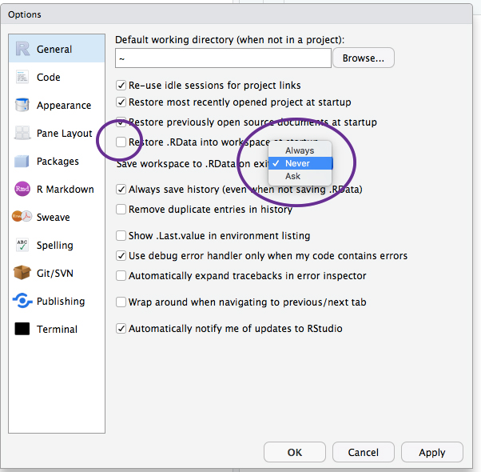
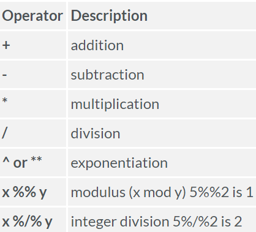
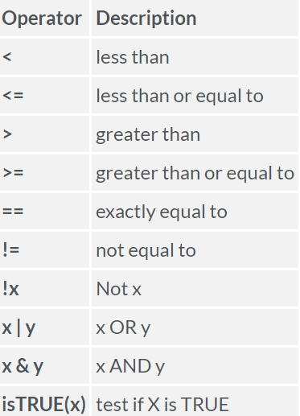
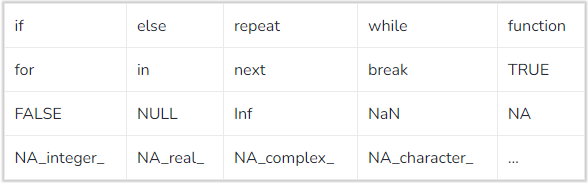
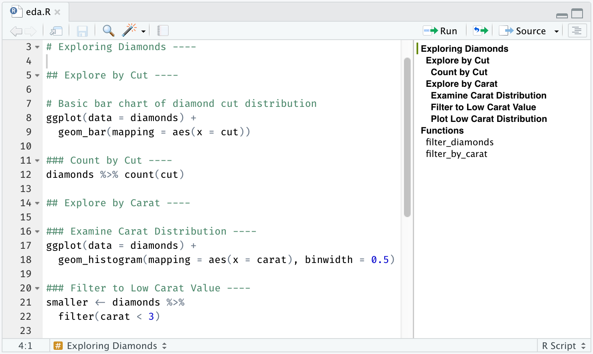
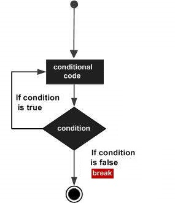

```{r setup, include=FALSE}
library(learnr)
knitr::opts_chunk$set(echo = FALSE)
```

{width=10%}

## Introdução {#intro}
O **R** é uma linguagem de programação que surgiu por volta de 1993, idealizada pelos estatísticos **Ross Ihaka** e **Robert Gentleman**. No Brasil, é comum os usuários utilizarem o artigo masculino para referenciarem à linguagem R - ele é um software livre baseado na linguagem S e seu nome provém em parte dessa similaridade, em parte das iniciais dos seus criadores (Ross e Robert). Veja mais detalhes dessa história [aqui](https://en.wikipedia.org/wiki/R_(programming_language)).

Este tutorial interativo vai abordar alguns tópicos fundamentais do R. O material é baseado na experiência do autor e em livre adaptação de fontes disponíveis *online*, apontadas diretamente no texto ou listadas na seção de [links úteis](#ref).

## RStudio {#rstudio}
A essa altura você já deve ter conhecido o **RStudio**, mas segue uma analogia interessante ([Fonte: ModernDive](https://moderndive.netlify.app/1-getting-started.html)).

{width=100%}

O tutorial das **R-ladies Sydney** faz um *tour* bastante didático pelo RStudio. Ele pode ser visto [neste link](https://rladiessydney.org/courses/ryouwithme/01-basicbasics-1/).

Para referência rápida, segue captura da tela padrão do RStudio, dividida em quadrantes.

{width=100%}

Abaixo, um exemplo de configuração que gostamos de fazer nas *Global Options*.

{width=60%}

## Porque usamos linguagens de programação?
A resposta simples é que elas nos dão mais **flexibilidade** que as planilhas ou qualquer outro software **enlatado**: 
passamos a ter o poder de criar **programas de computador** para automatizar a solução de problemas. Isso se dá através dos **algoritmos**.

Um **algoritmo** é um conjunto de instruções que realizam uma tarefa. Cada trecho de um programa poderia ser chamado de algoritmo, mas em geral damos destaque para os trechos que resolvem problemas **relevantes** de maneira **eficiente** (Bhargava, [Entendendo Algoritmos](https://www.google.com.br/books/edition/Entendendo_Algoritmos/HWewDgAAQBAJ?hl=pt-BR&gbpv=0)).

Podemos representar um algoritmo de pelo menos três maneiras:

* Linguagem natural
* Fluxograma
* Pseudocódigo

Segue um exemplo de algoritmo em **pseudocódigo**.

**Algoritmo 1** - Achar o maior elemento:

- Leia uma lista `L` de valores numéricos
- Seja `maior` igual ao primeiro elemento de `L`
- Para cada elemento `i` de `L`, do segundo até o último:
    - Se `i` for maior do que `maior`:
        - Faça `maior` igual a `i`
- Retorne o valor de `maior`

Aplique esse algoritmo **manualmente** na lista `{3; 7; 2; -1}` e veja se ele de fato encontra o maior valor. 

Ao final deste tutorial você deverá ser capaz de escrever um programa em R para implementar o **Algoritmo 1** de maneira automatizada.  

## Elementos de uma linguagem de programação
Esses são os elementos essenciais de uma linguagem de programação:

* Estruturas de dados
* Comandos de condição
* Comandos de repetição
* Funções

O R apresenta todos esses elementos e nós vamos ver cada um deles com detalhes ao longo deste material.

## O primeiro programa: Hello, world!
No estudo das linguagens de programação é tradicional que o primeiro programa de um iniciante seja simplesmente escrever um texto na tela, algo como [**Hello, world!**](https://en.wikipedia.org/wiki/%22Hello,_World!%22_program#Variations) 

Então vamos em frente: com ajuda do instrutor, use a **caixa de código** abaixo para escrever seu primeiro programa em R. Clique em **Run Code** para executar os comandos, clique em **Start Over** para limpar a caixa (o botão **Hint** traz uma dica para esse exercício).

```{r hello, exercise=TRUE}

```

```{r hello-hint}
print("Hello, world!")
```

O seu primeiro programa tem apenas uma instrução, a **função** `print()`. Mas, na prática, os programas vão ter dezenas ou centenas de instruções, ou usando o jargão dos programadores, dezenas ou centenas de **linhas de código**. Nesses casos não é prático ficar usando apenas a linha de comando (*command prompt*) no console do R, mas sim construir um arquivo de *script* contendo o programa. Se você ainda não viu como fazer isso usando a interface do RStudio, o instrutor certamente vai poder te mostrar ao longo deste tutorial.

### Incluindo comentários
O caractere `#` em uma linha de código do R marca o início de um **comentário** naquela linha. Qualquer anotação do programador à direita do `#` é ignorada pelo [interpretador](https://en.wikipedia.org/wiki/Interpreter_(computing)). Por exemplo, o nosso primeiro programa comentado poderia ser:

```{r eval=FALSE, echo=TRUE}
# Esse é meu primeiro programa comentado
print("Hello, world!")
```

### Maiúsculas e minúsculas
O R é *case-sensitive* porque diferencia letras maiúsculas e minúsculas. Experimente trocar o nome da função `print()` por `Print()` (com P maiúsculo) e veja o que acontece.

## Buscando ajuda 
O R tem um sistema de ajuda embutido na linguagem, acessível de maneira rápida com os atalhos de comando `?` e `??`. Por exemplo:

```{r eval=FALSE, echo=TRUE}
?"print"  # Ajuda focalizada: ocorrências exatas

??"print" # Ajuda abrangente: ocorrências parciais
```

## Funções básicas {#bas} 
Quando escrevemos nosso primeiro programa em R, usamos a **função** `print()` embutida na linguagem. Como nas planilhas eletrônicas, o R tem várias funções embutidas/internas (*built-in*) disponíveis. Listamos algumas dessas funções a seguir.

|Função|Descrição|Exemplos
|:-----|:--------|--------
|`abs(x)`|Calcula valor absoluto|`abs(-4)` = 4
|`sqrt(x)`|Calcula raiz quadrada|`sqrt(4)` = 2
|`round(x, digits)`|Arrendonda|`round(4.756, 2)` = 4.76
|`seq(from, to, by)`|Gera uma sequência|`seq(1, 10, 2)` = c(1, 3, 5, 7, 9)
|`rep(x, ntimes)`|Repete x *n* vezes|`rep(4, 5)` = c(4, 4, 4, 4, 4)
|`runif(n, min, max)`|Sorteia *n* números entre *min* e *max* com mesma probabilidade|`runif(3, 0, 1)` = c(0.30, 0.10, 0.75)|
|`rnorm(n, m, sd)`|Sorteia *n* números de acordo com uma distribuição normal com média *m* e desvio padrão *sd*|`rnorm(3, 0, 1)` = c(1.46, -0.80, -1.36)|
|`toupper(s)`|Transforma uma cadeia de caracteres em maiúscula|`toupper("abcdef")` = "ABCDEF"
|`tolower(s)`|Transforma uma cadeia de caracteres em minúscula|`tolower ("ABCDEF")` = "abcdef"
|`substr(s, start, stop)`|Seleciona uma *substring*|`substr("abcdef", 2, 4)` = "bcd"

Use a próxima caixa de código para explorar algumas das funções básicas do R, digitando sempre que necessário o comando `?<nome da função>` para fazer uso do sistema de ajuda. Procure reparar no uso do operador `=` para entrada explícita de **argumentos** (parâmetros) nas funções e na existência (ou não) de argumentos padrão, i.e., argumentos que são usados automaticamente se você não explicitar nenhum outro (isso é o que os programadores chamam de funcionamento *default* da função).

```{r basics, exercise=TRUE}

```

Uma das vantagens de uma linguagem de programação é a possibilidade de reutilizarmos pedaços de programas (**pedaços de código**) organizados em funções, sejam elas embutidas na própria linguagem, emprestadas de outros programadores (via importação de [pacotes](#packs)) ou desenvolvidas por nós mesmos (como  veremos mais a [frente](#fun)).

## Pacotes {#packs}
As funcionalidades do R estão organizadas em **pacotes** (`packages`), isto é, bibliotecas de funções e (as vezes) dados. Há um conjunto básico de pacotes que vem na instalação do R que se convenciona chamar de **R base**. Podemos listar esses pacotes com o seguinte comando:

```{r echo=TRUE}
rownames(installed.packages(priority="base"))
```

Grande parte do poder do R vem dos muitos pacotes desenvolvidos pela sua comunidade de usuários. Por exemplo, para executar este tutorial localmente precisamos instalar e carregar o pacote `learnr`. 

A forma padrão para você instalar um pacote no R é a seguinte ( certifique-se que você tem uma conexão com a internet):

```{r eval=FALSE, echo=TRUE}
install.packages("<nome do pacote>")
```

Você precisa instalar o pacote apenas uma vez no seu sistema. Mas a cada **sessão do R** vai precisar carregar na memória os pacotes que precisa. Temos dois comandos para isso:

```{r eval=FALSE, echo=TRUE}
library("<nome do pacote>")
require("<nome do pacote>")
```

Se por algum motivo precisar descarregar um pacote da memória, o comando é este:

```{r eval=FALSE, echo=TRUE}
detach("package:<nome do pacote>", unload=TRUE)
```

**Obs.:** A instalação e o carregamento de pacotes, assim como diversas outras operações, como a importação de planilhas, também podem ser feitas diretamente pela interface do RStudio. 

Não é muito usual, mas é possível remover um pacote instalado da seguinte forma:

```{r eval=FALSE, echo=TRUE}
remove.packages("<nome do pacote>")
```

Se você quiser ser explícito em dizer de qual pacotes está vindo um determinado objeto (normalmente uma função), você deve usar o operador `::`. Por exemplo, para explicitar que a função `print` faz parte do pacote `base`:

```{r eval=FALSE, echo=TRUE}
base::print("Hello, world!") 
```

## Pacotes no GitHub {#packs2}
Vimos anteriormente a forma padrão para instalação de pacotes no R, onde a origem é o repositório da linguagem na rede [CRAN]((https://cran.r-project.org/)). Contudo, mais recentemente, muitos programadores têm hospedado seus pacotes no site [GitHub](https://github.com/) para controle de versão e colaboração (para isso precisam de um ferramenta chamada [git](https://git-scm.com/) instalada nos seus computadores):  

>GitHub is a website that serves as home for git repositories. It’s sort of like facebook for programmers (and data scientists): everyone’s on there; you can look at what they’re working on and easily peruse their code and make suggestions or changes.
— Karl Broman

O R permite que você carregue pacotes diretamente do GitHub usando o comando `devtools::install_github()`. Isso vai ser particularmente útil quando você estiver em um nível avançado no R e desejar criar seus **próprios** pacotes. Saiba tudo sobre este assunto no [*R Packages*](https://r-pkgs.org/) de Hadley Wickham e no [*R package primer*](https://kbroman.org/pkg_primer/) de Karl Broman.

## Operadores aritméticos 
Esta é a lista de operadores aritméticos do R ([Fonte: Quick-R](https://www.statmethods.net/management/operators.html)):

{width=30%}

Use a caixa de código abaixo para testar esses operadores. Você estará usando o R como uma simples calculadora!

```{r two-plus-two, exercise=TRUE}

```

### Precedência
Use a próxima caixa de código para reproduzir a expressão abaixo, de maneira que as regras de **precedência** da matemática estejam respeitadas. O resultado final deve ser aproximadamente **3.496**.

$$\frac{3 \times \sqrt{4.4}}{\dfrac{12}{15}+1}$$
```{r precedencia, exercise=TRUE}

```

```{r precedencia-hint}
3*(4.4)^0.5/(12/15+1) #3.4960294939005054
```

### Inf e NaN
Vamos comentar sobre duas [palavras reservadas](#pres) do R relacionadas a operações aritméticas: `Inf` e `NaN`.

`Inf` significa **Infinito** e ocorre em situações similares à divisão de um número, diferente de zero ou infinito, por zero.

```{r eval=TRUE, echo=TRUE}
1/0
```

`NaN` significa **Not a Number** e ocorre em casos de indeterminação, como nas divisões `0/0` ou `Inf/Inf`, ou no produto `Inf*0`.

```{r eval=TRUE, echo=TRUE}
0/0
Inf/Inf
Inf*0
```

## Operadores lógicos 
Esta é a lista de operadores lógicos do R ([Fonte: Quick-R](https://www.statmethods.net/management/operators.html)):

{width=30%}

Os operadores lógicos, as vezes chamados de relacionais, realizam operações cujo resultado pode assumir apenas dois valores: **VERDADEIRO** (`TRUE` ou `T`) ou **FALSO** (`FALSE` ou `F`). 

Vamos explorar inicialmente o operador de igualdade `==`. Analise com seu instrutor as linhas de código abaixo. **Atenção:** não confundir o operador `==` com `=`. 

```{r eval=TRUE, echo=TRUE}
# Comparação de números
3 == (2 + 1)

# Comparação de cadeias de caracteres (strings)
"Rafael" == "RAFAEL"

# Comparação de valores lógicos
TRUE == T
```

Observe agora alguns usos dos operadores de desigualdade `!=`, negação `!`, maior `>`, maior ou igual `>=`, menor `<` e menor ou igual `<=`:

```{r eval=TRUE, echo=TRUE}
3 != (2 + 1)

"Rafael" != "RAFAEL"

TRUE == !FALSE

(-6 * 5 + 2) >= (-10 + 1)

"Bola" < "Aquario"

10 <= 10

TRUE > FALSE
```

Depois de analisar esses resultados, use a caixa de código abaixo para fazer outros testes, usando também os operadores **OU** (`|`) e **E** (`&`). Veja a dica do exercício sobre eles.

```{r logicals, exercise=TRUE}

```

```{r logicals-hint}
(T & T) == T
(T & F) == F
(F & F) == F
(T | T) == T
(T | F) == T
(F | F) == F 
```

## Criando variáveis 
Depois que você executou os seus primeiros comandos em R, vamos avançar um pouco mais e apresentar o **operador de atribuição**: `<-`. 

A atribuição é a forma padrão de criarmos **variáveis** (objetos) nos nossos programas, ou em termos mais técnicos, é a forma de criarmos espaços **nomeados** e **acessíveis** na memória do computador.

Na caixa de código abaixo, incrementamos o programa "Hello, world!" para considerar a criação de uma variável com o texto que queremos imprimir. Experimente mudar o texto ou criar outros nomes de variável. **Dica:** No RStudio, você pode usar o atalho `ALT+-` para criar um operador de atribuição.

```{r hello2, exercise=TRUE}
texto1 <- "Hello, world!"
texto2 <- "Oi, mundo!"
print(texto1)
print(texto2)
```

**Atenção:** Embora o operador `=` funcione como um sinônimo do operador de atribuição `<-`, ele costuma ser muito mais usado para definir parâmetros de funções, como vimos [anteriormente](#bas).

A criação de variáveis é fundamental em programas reais, pois é através delas que o programador (re)utiliza a memória de maneira organizada em seus programas. 

## Nomeando objetos
>There are only two hard things in Computer Science: cache invalidation and naming things.
— Phil Karlton

Há algumas regras para nomeações de objetos no R. 

- Um nome **sintaticamente válido** consiste de letras, números e os caracteres `.` e `_`, devendo começar por uma letra ou um `.` não seguido por um número. Nomes como  como *.2way* são proibidos, assim como nomes já usados pela linguagem, isto é, suas [palavras reservadas](pres). Fonte: `?make.names`.

É importante que toda equipe de programadores estabeleça suas convenções de nomes. Isso é importante porque agiliza a leitura e depuração de programas extensos. Seguem algumas sugestões: 

* Os nomes devem ser preferencialmente **minúsculos**
* Quando necessário, usar o  *underscore* `_` para separar nomes compostos
* Criar nomes que facilitem o entendimento do programa 
* Usar **substantivos** para variáveis: `dia_inicial`
* Priorizar o uso de **verbos** para funções: `calcula_media()`

## Palavras reservadas {#pres}
Podemos conferir as palavras reservadas do R executando o seguinte comando:

```{r eval=FALSE, echo=TRUE}
?"reserved"
```

{width=70%}

## Estruturas de dados
O conceito de estrutura de dados especializa o conceito mais abstrato de variável/objeto. Uma **estrutura de dados** é uma coleção de dados de mesmo tipo ou não (**homogênea** x **heterogênea**), que tem um nome e pressupõe uma dada organização e forma de acesso dentro de um programa.  Exemplos de tipos **básicos** (primitivos) que podem compor uma estrutura de dados: **número** e **texto**.

## Tipos básicos
No R temos os seguintes tipos básicos:

|Tipo|Exemplos|
|:---|:-------|
|`character`|"Alô"; 'bola'; "55"|
|`double`|12.3|
|`integer`|12L|
|`logical`|TRUE (T); FALSE (F)|
|`complex`|3 + 2i|

 **Obs.:** $i = \sqrt{-1}$.

Use a caixa de código abaixo para criar variáveis simples com os diferentes tipos básicos (por exemplo, `x <- 5`) e aplique a função `typeof()` para confirmar esses tipos.

```{r basicTypes, exercise=TRUE}

```

Antes de explorarmos a criação de **coleções** a partir dos tipos básicos, vamos conhecer algumas funções gerais de inspeção de estruturas de dados no R.

|Função|Finalidade|
|:-----|:---------|
|`class()`|Saber a classe (tipo maior) do objeto|
|`typeof()`|Saber o tipo básico do objeto|
|`str()`|Saber a estrutura do objeto|
|`length()`|Saber o número de elementos do objeto|
|`dim()`|Saber o número de dimensões do objeto|
|`summary()`|Fazer um resumo estatístico dos elementos do objeto|
|`ls()`|Listar os objetos na memória (*environment*)|
|`rm()`|Deletar um objeto da memória

## Coleções homogêneas
Entende-se por **homogênea** uma coleção cujos elementos são sempre do mesmo tipo básico. São coleções homogêneas:

* Vetores
* Matrizes
* *Arrays*
* Fatores

### Vetores
Um vetor é uma coleção homogênea **1-D**. A forma mais direta de criar um vetor é através da função `c()`. Por exemplo:

```{r eval=TRUE, echo=TRUE}
#Vetor de números
x <- c(3,5,8)
class(x)
typeof(x)
str(x)
length(x)
dim(x)
summary(x)

#Vetor de caracteres
y <- c("a","d","b")
class(y)
typeof(y)
str(y)
length(y)
dim(y)
summary(y)
```

**Tudo no R é no fundo um vetor**. Quando fazemos `x <- 5`, x é um vetor unidimensional de tamanho 1 e tipo `double()`. Podemos confirmar isso usando a função `is.vector()`:

```{r eval=TRUE, echo=TRUE}
x <- 5
is.vector(x)
```

Na caixa de código abaixo, verifique o resultado das funções de inspeção quando aplicadas sobre um vetor `z <- c(1, "a", 2.14)`.

```{r vectors1, exercise=TRUE}
z <- c(1, "a", 2.14)
```

Criado um vetor, seus elementos podem ser **acessados** pelo operador `[<índices>]`. Exemplos:

```{r eval=TRUE, echo=TRUE}
x <- c(3,5,8)
y <- c("a","d","b")
x[1]
y[2]
x[c(1,3)]
x[2:3]
y[]
y[length(y)]
```

**Importante:** No R toda coleção começa pelo índice **1**. Isso explica o cabeçalho `[1]` que sempre aparece no console do R quando mandamos imprimir uma variável.

A função `c()` também serve para **adicionar** elementos:

```{r eval=TRUE, echo=TRUE}
x <- c(3,5,8)
x <- c(x, 13)
x
x <- c(x, c(21, 34))
x
```

Em muitos casos, pode ser útil criar um vetor usando a função `seq()`:

```{r eval=TRUE, echo=TRUE}
z <- seq(10)
z
z <- 1:10 
z
typeof(z)
z <- seq(from = 1, to = 10, by = 0.1)
z
typeof(z)
```

Observamos que vetores também podem ser criados sem elementos explícitos, usando a função `vector()` ou, mais diretamente, as funções `integer()`, `double()`,  `character()` ou `logical()`:

```{r eval=TRUE, echo=TRUE}
w1 <- vector(mode="integer", length=3)
w2 <- integer(length=3)
w1
w2
```

Use a caixa de código abaixo para explorar a criação de vetores sem elementos explícitos.

```{r vectors2, exercise=TRUE}

```

### Matrizes
Matrizes são coleções homogêneas **2-D**, organizadas em linhas e colunas. Pode-se criar matrizes vazias [(`NA`)](#na) ou com um valor fixo em todas as posições: 

```{r eval=TRUE, echo=TRUE}
m <- matrix(nrow = 3, ncol = 3)
m 
m <- matrix(0, nrow = 3, ncol = 3)
m
```

Também é possível criar matrizes a partir de vetores:

```{r eval=TRUE, echo=TRUE}
x <- c(3,5,8)
m <- matrix(x, nrow = 3, ncol = 3)
m 
m <- matrix(x, nrow = 3, ncol = 3, byrow = TRUE)
m
x <- 1:3
y <- 10:12
cbind(x, y)
rbind(x, y)
```

A forma de acessar elementos de matrizes é com o operador `[<linhas>, <colunas>]`. Por exemplo:

```{r eval=TRUE, echo=TRUE}
x <- 1:9
m <- matrix(x, nrow = 3, ncol = 3)
m
m[3, 3]
m[1:2, 2]
m[, 3]
```

O trecho de código abaixo mostra como funcionam as funções de inspeção sobre matrizes.

```{r eval=TRUE, echo=TRUE}
m <- matrix(0.5, nrow = 3, ncol = 3)
m
class(m)
typeof(m)
str(m)
length(m)
dim(m)
summary(m)
z <- m
z[1, 1] <- "casa"
z
class(z)
typeof(z)
```

### Arrays
*Arrays* (arranjos) generalizam vetores e matrizes: são coleções homogêneas **N-dimensionais**.

```{r eval=TRUE, echo=TRUE}
a <- array(dim = c(3,3,2))
a
a <- array(0.3, dim = c(3,3,2))
a
class(a)
typeof(a)
str(a)
length(a)
dim(a)
a[1,1,1] <- "bola"
a
class(a)
typeof(a)
```

Use a caixa de código abaixo para explorar a criação e inspeção de *arrays*.

```{r arrays, exercise=TRUE}

```

### Fatores
Fatores são casos particulares de vetores onde a coleção pressupõe um número finito de valores **qualitativos**, com cada valor possível sendo chamado de **nível** (*level*). Reafirmando a vocação estatística do R, fatores são estruturas específicas para representação de variáveis **categóricas**, ordinais ou não (nominais).

Como exemplo, vamos criar a variável `escolaridade` usando uma estrutura de fator com 3 níveis: "F" (Fundamental), "M" (Médio) e "S" (Superior):

```{r eval=TRUE, echo=TRUE}
# Exemplo com 10 observações:
# - 5 Superior
# - 3 Médio
# - 2 Fundamental 
escolaridade <- c(rep("S",5), rep("M",3), rep("F",2))
escolaridade
escolaridade <- factor(escolaridade)
summary(escolaridade)
nlevels(escolaridade)
class(escolaridade)
typeof(escolaridade)
str(escolaridade)
length(escolaridade)
dim(escolaridade)
escolaridade[4:7]
```

A função `factor()`, em sua forma *default*, vai associar  cada nome de categoria a um número inteiro, usando ordem **alfabética**. Assim, no caso da variável `escolaridade`, temos "F" = 1, "M" = 2 e "S" = 3. Como quase sempre no R, se o programador desejar, é possível configurar a função para que ela mude seu comportamento padrão:

```{r eval=TRUE, echo=TRUE}
escolaridade <- c(rep("S",5), rep("M",3), rep("F",2))
escolaridade
escolaridade <- factor(escolaridade, levels = c("S","M","F"))
str(escolaridade)
```

## Coleções heterogêneas
Coleções **heterogêneas** podem misturar elementos de diferentes tipos básicos. São coleções heterogêneas:

* Listas
* Data Frames

### Listas
Listas são coleções bastante flexíveis: podem abrigar qualquer combinação de objetos e seus tipos básicos, inclusive outras listas. Vejamos um exemplo simples:

```{r eval=TRUE, echo=TRUE}
lista <- list(1, "a", TRUE, 1+4i)
str(lista)
typeof(lista)
length(lista)
dim(lista)
```

A maneira mais direta de acessarmos os elementos de uma lista é usando o operador `[[<índices>]]`. Perceba na execução do código abaixo a diferença entre os operadores `[[]]` e `[]`. 

```{r eval=TRUE, echo=TRUE}
lista <- list(1, "a", TRUE, 1+4i)
str(lista)
lista[[4]]
typeof(lista[[4]])
typeof(lista[4])
```

Seguindo para um exemplo mais complexo, é possível termos uma lista com os seguintes **4** elementos: **1** vetor numérico, **1** matriz de caracteres, **1** (sub)lista com números e texto e **1** escalar (vetor unitário)! Vejamos:

```{r eval=TRUE, echo=TRUE}
v1 <- c(1,2,3)
m1 <- matrix("a",2,2)
l1 <- list(c(1,2,3),"teste")
e1 <- 10
lista <- list(v1, m1, l1, e1)
lista
str(lista)
```

As listas podem ter seus elementos **nomeados**. Nesse caso, o acesso pode ser feito também com o operador `$`. Por exemplo:

```{r eval=TRUE, echo=TRUE}
lista <- list(nome1 = 1, nome2 = "a", nome3 = TRUE, nome4 = 1+4i)
str(lista)
lista[[4]]
lista$nome4
```

A função `names()` pode ser útil tanto para encontrar os nomes dos elementos de uma lista quanto para mudá-los se for necessário. Use a caixa de código abaixo para testá-la.

```{r list, exercise=TRUE}
lista <- list(Nome = c("João", "Maria"), Nota = c(8,10))
str(lista)
names(lista)
```

```{r list-hint}
names(lista) <- c("NOME", "NOTA")
```

### Data Frames
*Data frames* são casos particulares de listas onde os elementos são todos vetores do mesmo tamanho. Se imaginarmos os vetores componentes verticalizados e postos lado a lado, o data frame vai apresentar a mesma organização tabular de uma matriz, mas com a vantagem de poder reunir colunas com diferentes tipos básicos.  

É intuitivo pensar que os data frames (ou pequenas variações deles) são as estruturas de dados do R que mais aparecem nos projetos, pelo seu formato tabular clássico que já conhecemos das planilhas eletrônicas: quando importamos dados de uma planilha com a função `read.csv()` (o que pode ser feito diretamente pela interface do [RStudio](https://support.rstudio.com/hc/en-us/articles/218611977-Importing-Data-with-the-RStudio-IDE)), o objeto criado no R com os dados é um data frame. Fato é que, independente da tecnologia utilizada, a forma tabular ainda é a forma o padrão de organizarmos dados estatísticos e de engenharia.

Criando um data frame manualmente:

```{r eval=TRUE, echo=TRUE}
dat <- data.frame(id = letters[1:10], x = 1:10, y = 11:20)
dat
class(dat)
typeof(dat)
str(dat)
dim(dat)
```

Assim como nas listas, os elementos dos data frames podem ser acessados com `[[<índices>]]` e `$`. Mas, diferente das listas e particularmente por seu formato tabular, eles também podem ser acessados como as matrizes, com o operador `[<linhas>, <colunas>]`: 

```{r eval=TRUE, echo=TRUE}
dat <- data.frame(id = letters[1:10], x = 1:10, y = 11:20)
dat
dat[["y"]]
dat$y
dat[1, 3]
```

**Obs.:** Se todas as colunas de um data frame forem do mesmo tipo básico, ele pode ser convertido numa matriz com as funções `data.matrix()` ou `as.matrix()`.

Algumas funções de inspeção úteis para data frames:	

```{r eval=TRUE, echo=TRUE}
dat <- data.frame(id = letters[1:10], x = 1:10, y = 11:20)
dat
head(dat)	#Listagem dos 6 primeiros elementos
tail(dat)	#Listagem dos 6 últimos elementos
nrow(dat)	#Número de linhas
ncol(dat)	#Número de colunas
summary(dat)
```

## Dados faltantes - NA
Em um projeto real de análise de dados temos que lidar com dados faltantes. O símbolo `NA` - **Not Available** - é utilizado no R para representar explicitamente quando um dado está faltando em uma coleção. Por exemplo:

```{r eval=TRUE, echo=TRUE}
x <- c("a", NA, "c", "d", NA)
is.na(x)
anyNA(x)
```

As funções `is.na()` e `anyNA()`, entre outras, podem ajudar a identificar dados faltantes e assim permitir seu tratamento ou mesmo descarte antes de uma análise. 

## Scripts
Minimize momentaneamente o tutorial e abra uma nova instância do RStudio. Com ajuda do instrutor, reproduza o código de algum dos exercícios anteriores em um arquivo de **script** do R, como alternativa a digitação sequencial de instruções na linha de comando.

{width=100%}

[Fonte: RStudio Blog](https://www.rstudio.com/blog/rstudio-v1-4-preview-little-things/). 

## Comandos de condição
Comandos de condição são os elementos de uma linguagem de programação que permitem que o mesmo programa seja executado de maneira diferente, dependendo se um conjunto de condições é atendido ou não. Normalmente, para reconhecermos se um conjunto de condições é ou não é atendido, usamos os rótulos lógicos **VERDADEIRO** (`TRUE`) ou **FALSO** (`FALSE`).

No R os principais comandos de condição são a combinação `if()...else()` e o `switch()`. As figuras a seguir ilustram em fluxograma o funcionamento desses comandos (Fonte: [Tutorialspoint](https://www.tutorialspoint.com/r/r_decision_making.htm)).

|`if()...else()`|`switch()`|
|---------------|----------|
|||

**Atenção:** O `else()` nem sempre precisa estar presente! É possível termos o `if()` sozinho e ainda há opção do comando `ifelse()` - aprenda sobre o funcionamento dele fazendo `?ifelse`.

Verifique agora o funcionamento prático dos comandos com as caixas de código abaixo. 

`if()...else()`
```{r if, exercise=TRUE}
# Execute o código com diferentes valores de x...
x <- 1

if(x == 1) {
   print("VERDADEIRO!")
} else {
   print("FALSO!")
}
```

`switch()`
```{r switch1, exercise=TRUE}
# Execute o código com diferentes valores de x...
x <- "1"

y <- switch(
   x,
   "1" = "Primeiro!",
   "2" = "Segundo!",
   "3" = "Terceiro!",
   "4" = "Quarto!",
   "Opção inválida!"
)
print(y)
```

```{r switch2, exercise=TRUE}
# Versão "numérica" do switch()
x <- 1

y <- switch(
   x,
   "Primeiro!",
   "Segundo!",
   "Terceiro!",
   "Quarto!"
)
if (is.null(y)) {y <- "Opção inválida!"}
print(y)
```

## Comandos de repetição
Os comandos de repetição (iteração), junto com as [funções customizadas](#fun), são os principais responsáveis pela automação de tarefas nas linguagens de programação.

No R existem os comandos de repetição tradicionais, que criam ciclos explícitos nos programas - chamados de  laços ou ***loops*** - e os comandos de repetição **vetorizados** ou **funcionais**, onde os ciclos de execução estão implícitos. 

### Comandos tradicionais (*loops*)
Para criação de *loops*, o R oferece os comandos `repeat()`, `while()` e `for()`. As figuras a seguir ilustram em fluxograma o funcionamento desses comandos (Fonte: [Tutorialspoint](https://www.tutorialspoint.com/r/r_loops.htm)).

|`repeat()`|`while()`|`for()`|
|----------|---------|-------|
||||

Verifique agora o funcionamento prático dos comandos com as caixas de código abaixo.

`repeat()`
```{r repeat, exercise=TRUE}
#Execute o código com diferentes valores de "lim"...
txt <- "OI,loop!"
cont <- 1
lim <- 5

repeat {
   print(txt)
   cont <- cont+1
   if(cont > lim) {
      break
   }
}
```

`while()`
```{r while, exercise=TRUE}
# Execute o código com diferentes valores de "lim"...
txt <- "OI,loop!"
cont <- 1
lim <- 5

while (cont <= lim) {
   print(txt)
   cont = cont + 1
}
```

`for()`
```{r for, exercise=TRUE}
# Execute o código com diferentes valores de "lim"...
txt <- "OI,loop!"
lim <- 5

for (cont in 1:lim) {
   print(txt)
}
```

**Atenção:** No uso de *loops*, uma boa prática é **pré-alocar a memória** que será usada. Vamos ver o que queremos dizer com isso nos exemplos de código abaixo.

```{r eval=FALSE, echo=TRUE}
# Loop SEM pré-alocação de memória
j <- 1
for (i in 1:10) {
    j[i] = 10
}

# Loop COM pré-alocação de memória
j <- rep(NA, 10)
for (i in 1:10) {
    j[i] = 10
}
```

A **alocação de memória**, isto é, a reserva de espaço no hardware para abrigar uma variável, é uma tarefa em geral lenta nas linguagens de programação. Assim, o segundo trecho é preferível em relação ao primeiro, porque evita a necessidade de realocação de memória a cada vez que o vetor aumenta.    

### Comandos vetorizados
Os comandos **vetorizados** ou **funcionais** recebem vetores (ou matrizes, ou listas) e aplicam funções arbitrárias sobre seus elementos. Esses comandos são também chamados no R de **comandos da família** `apply()`. Vejamos um exemplo de uso:

```{r eval=TRUE, echo=TRUE}
# Matriz m x n com valores normais (média 0, dp 1)
m <- 100
n <- 10
x <- matrix(rnorm(m*n), nrow=m)

# Calcula o valor máximo por linha c/ LOOP
x1 <- rep(NA, m)
for(i in 1:m) {
  x1[i] <- max(x[i,])
}
    
# Calcula o valor máximo por linha c/ APPLY
x2 <- apply(x, 1, max)

# Verifica se x1 e x2 são iguais
all(x1 == x2)
```

Temos duas características esperadas nos comandos vetorizados: 

* Já cuidam da pré-alocação de memória
* São intrinsicamente **paralelizáveis**

Sobre essa última característica, significa que a ordem das iterações não é importante, ou seja, o que acontece numa iteração não afeta as iterações seguintes. Em um *loop* essa implicação é possível e é o que os programadores chamam de **efeito colateral**.

**Atenção:** Os comandos da família `apply()` são preferíveis à escrita de *loops* principalmente pela concisão, mas **não necessariamente** pelo melhor desempenho. Neste [link](https://kbroman.org/blog/2013/04/02/apply-vs-for/) há uma análise interessante sobre esse tema.

#### Caso particular: operações matriciais
Um caso particular de comandos vetorizados são os que realizam operações matriciais. O cálculo entre matrizes é a base da **álgebra linear**, disciplina fundamental para muitas coisas na área de estatística e computação, incluindo, por exemplo, os algoritmos de **_machine learning_**. 

Há linguagens de programação especializadas em operações matriciais, como o **MATLAB** (MAtrix LABoratory) e sua versão *free*, o **Octave**. O **R base** tem algumas funções para operações matriciais, mas há diversos pacotes específicos para isso, incluindo um pacote emulador do [MATLAB](https://cran.r-project.org/web/packages/matlab/index.html). 

Seguem alguns exemplos de operadores matriciais no R (sendo **A** e **B** matrizes compatíveis pelas regras da álgebra linear):

|Função|Descrição|
|:-----|:---------|
|`A*B`|Multiplica elemento-a-elemento (*element-wise*)|
|`A%*%B`|Multiplica matricialmente|
|`t(A)`|Calcula a matriz transposta|
|`cbind(A,B,...)`|Combina matrizes (vetores) horizontalmente numa matriz|
|`rbind(A,B,...)`|Combina matrizes (vetores) verticalmente numa matriz|
|`rowMeans(A)`|Calcula vetor de médias por linhas|
|`rowSums(A)`|Calcula vetor somas por linhas|
|`colMeans(A)`|Calcula vetor de médias por colunas|
|`colSums(A)`|Calcula vetor de somas por colunas|

Use a caixa de código abaixo para explorar algumas das funções acima, usando as matrizes **A**, **B**, **C** e **D** pré-definidas.

```{r matriciais, exercise=TRUE}
A <- matrix(c(1:12), 3, 4)
B <- matrix(c(1:12), 3, 4, byrow = TRUE)
C <- matrix(1:4, 4, 1)
D <- matrix(1:3, 3, 1)

```

## Funções customizadas {#fun}
Além das funções que já vêm embutidas no R ou que podem ser importadas de pacotes adicionais, uma das grandes vantagens das linguagens de programação é a possibilidade de criarmos nossas próprias funções (e posteriormente organizá-las em nossos [próprios pacotes](#packs2) se assim desejarmos). Vejamos um exemplo:

```{r eval=TRUE, echo=TRUE}
# Cria uma função para calcular uma sequência de quadrados
calcula_quadrados <- function(a) {
  s <- rep(NA, a)      
  for(i in 1:a) {
    s[i] <- i^2
  }
  return(s) # Indica o ponto de retorno da função
}

# Chama a função usando o valor 6 como argumento
calcula_quadrados(6)
```

Se você chamar a função `calcula_quadrados()` **sem os argumentos** que ela espera receber, vai perceber um erro de execução no momento em que a variável `a` for necessária no **corpo** da função. Mas é possível criar funções que minimizem esse problema, definindo valores *default* para seus argumentos:

```{r eval=TRUE, echo=TRUE}
# Cria uma função multiplicar 2 números (com valores default)
multiplica <- function(a = 0, b = 1) {
   result <- a * b
   return(result)
}

# Chama a função usando diferentes combinações de argumentos
multiplica(6, 6)
multiplica(6)
multiplica(b=6)
multiplica(a=6, b=6)
multiplica()
```

Na caixa de código abaixo, escreva a função `soma()` para somar dois números `a` e `b`. Teste seu uso com diferentes argumentos.

```{r add-function, exercise=TRUE}
soma <- function() {
  
}
```

### Rertorno nulo (NULL) 
Pode acontecer de uma função não conseguir realizar a tarefa para a qual foi programada. Em muitos casos isso vai ocorrer  porque os argumentos recebidos não atenderam a alguns pré-requisitos: por exemplo, para multiplicar dois números não esperamos receber argumentos do tipo texto. 

Nessa linha, é uma boa prática do programador fazer uma análise prévia dos argumentos sendo recebidos pela sua função. Em casos em que esses argumentos estejam fora das especificações - ou em casos de qualquer outra falha no corpo da função - ele pode sinalizar ao usuário com uma mensagem de erro padronizada e usar a palavra [reservada](#pres) `NULL` (nulo) como retorno da função, usando o comando `return(NULL)`.

## Paradigmas de programação
O **paradigma de programação** é a metodologia com a qual o programador organiza suas ideias e escreve seus programas. Algumas linguagens podem favorecer (ou impor) o uso de um determinado paradigma mas, na prática, os programas acabam usando mais de um paradigma ao mesmo tempo (isso ocorre no R!).

Vamos considerar aqui dois grandes paradigmas: programação **funcional**, onde os programas são organizados preferencialmente em [**funções puras**](https://en.wikipedia.org/wiki/Pure_function), e programação **orientada a objetos** (POO), onde os programas são organizados preferencialmente em [**objetos**](https://en.wikipedia.org/wiki/Object-oriented_programming). 

O R é essencialmente uma linguagem ligada ao paradigma funcional, mas também provê mecanismos de POO. Por exemplo, a característica de **polimorfismo** da orientação a objetos é o conceito em que a mesma função `summary()` tem comportamentos diferentes se o tipo de entrada for diferente:

```{r eval=TRUE, echo=TRUE}
v1 <- c(rep("S",50), rep("M",30), rep("F",20))
summary(escolaridade1)

escolaridade2 <- factor(escolaridade1)
summary(escolaridade2)
```

Maiores detalhes sobre paradigmas de programação no R podem ser vistos no [*Advanced R*](https://adv-r.hadley.nz/) de Hadley Wickham.  

## Exercícios
Agora que já passamos pelos elementos essenciais da linguagem, você pode tentar implementar algumas funções e algoritmos em R. 

**Atenção**: Alguns exercícios tem botão de dicas (**Hint**)!

### Exercício 1 - Médias
Escreva a função `calcula_media()`, recebendo como argumentos:

- `x`: real
- `y`: real
- `tipo_media`: inteiro

No corpo da função avalie o seguinte:

* Se `tipo_media == 1` retorne a **média geométrica** $\sqrt{xy}$.
* Senão, retorne a **média aritmética** $(x+y)/2$.

```{r ex1, exercise=TRUE}
calcula_media <- function(x, y, tipo_media = 0) {
#SEU CÓDIGO AQUI
}
```

### Exercício 2 - Maior elemento
Escreva a função `acha_maior()` para achar o maior elemento de um vetor. Ela deve implementar o seguinte algoritmo:

- Leia um vetor `vec` de valores numéricos
- Seja `maior` igual ao primeiro elemento de `vec`
- Para cada elemento `i` de `vec`, do segundo até o último:
    - Se `i` for maior do que `maior`:
        - Faça `maior` igual a `i`
- Retorne o valor de `maior`

Teste sua função com o vetor `c(3, 7, 2, -1)` e veja se ela de fato acha o maior elemento. 

```{r ex2, exercise=TRUE}
acha_maior <- function(vec) {
#SEU CÓDIGO AQUI
}
```

### Exercício 3 - É par?
Escreva a função `eh_par()` para identificar se um número é par ou ímpar. Ela deve implementar o seguinte algoritmo:

- Leia um número inteiro `n`
- Seja `r` o resto da divisão de `n` por `2`
- Se `r` for igual a `0`:
    - Retorne `TRUE`
- Senão:
    - Retorne `FALSE`

Teste sua função com números pares e ímpares. Ela deve retornar o valor lógico `TRUE` se o número for par. 

```{r ex3, exercise=TRUE}
eh_par <- function(n) {
#SEU CÓDIGO AQUI
}
```

```{r ex3-hint}
9 %% 2 # resto 1: ímpar
8 %% 2 # resto 0: par
```

### Exercício 4 - Conta pares
Escreva a função `conta_pares()` para contar os números pares em um vetor. Ela deve usar a função `eh_par()` do exercício anterior e implementar o seguinte algoritmo:

- Leia um vetor `vec` de números inteiros 
- Seja `cont` igual a `0`
- Para cada elemento `i` de `vec`, do primeiro ao último:
    - Seja `result` o resultado de `eh_par(i)`
    - Se `result` for `TRUE`:
        - Adicione `1` ao valor de `cont`
- Retorne `cont`

Teste sua função com diferentes vetores de entrada.

```{r ex4, exercise=TRUE}
eh_par <- function(n) {
#SEU CÓDIGO AQUI
}
conta_pares <- function(vec) {
#SEU CÓDIGO AQUI
}
```

### Exercício 5 - Fatorial
Escreva a função `fatorial()` para calcular o fatorial de um número inteiro $n$. A função fatorial é definida como $n! = 1 \times 2 \times \cdots\times(n-1)\times n$.

```{r ex5, exercise=TRUE}
fatorial <- function(n) {
#SEU CÓDIGO AQUI
}
```

```{r ex5-hint}
n <- 5
p <- 1
for (i in 1:n)
    p <- p*i
print(p)
```

### Exercício 6 - Raiz quadrada
Escreva a função `calcula_raiz()` para implementar o [método babilônico](https://pt.wikipedia.org/wiki/Raiz_quadrada#Método_babilônico) de cálculo da raiz quadrada de $n$. Siga os seguintes passos:

* Defina o valor de $n$ ($n \in \mathbb{R}$)
* Inicie `raiz` como `raiz` = $\frac{n}{2}$
* Substitua `raiz` pela **média aritmética** de `raiz` e  $\frac{n}{raiz}$
* Repita o passo anterior para obter uma aproximação melhor
  - Até que `raiz * raiz` $\approx$ $n$ (com tolerância $\epsilon$)
* Retorne `raiz`

Use sua função para calcular a raiz quadrada dos números abaixo, com tolerância $\epsilon = 10^{-6}$.

| $n$ | $\sqrt{n}$ |
|:---:|:----------:|
|  7  | 2.645751   |
| 13  | 3.605551   |
| 42  | 6.480741   |

```{r ex6, exercise=TRUE}
calcula_raiz <- function(n) {
#SEU CÓDIGO AQUI
}
```

```{r ex6-hint}
n <- 7
tol <- 1e-6
raiz <- n/2
aprox_ruim <- TRUE
while (aprox_ruim) {
  raiz <- (raiz + n/raiz)/2
  erro <- abs(raiz**2 - n)
  aprox_ruim <- (erro > tol)
}
print(raiz)
```

## Epílogo: o operador *pipe* `%>%`  
Percorremos os principais elementos da linguagem R e chegamos ao final deste tutorial. A partir daqui você estará pronto para iniciar sua jornada na solução de problemas reais. Não é novidade que o *Google* vai ser um grande companheiro!

Antes de terminar, queremos mencionar o operador *pipe* `%>%`. Ele assumiu relevância no uso recente do R pelo seu emprego no conjunto de pacotes conhecido como [`tidyverse`](https://www.tidyverse.org/packages/), que se tornou referência na comunidade de ciência de dados.    

O *pipe* `%>%` surgiu no pacote `magrittr` de Stefan Milton Bache, mas o `tidyverse` já carrega o operador automaticamente. Assim, se você for trabalhar com o conjunto de pacotes `tidyverse`, como tem sido o padrão para os cientistas de dados, não vai precisar carregar o `magrittr` de maneira explícita. 

Vejamos um exemplo de código com e sem *pipes*:

```{r eval=FALSE, echo=TRUE}
# Carrega o núcleo de pacotes do tidyverse
library(tidyverse)

# Seja x um vetor com os valores de 1 a 4 
x <- c(1, 2, 3, 4)

# Vamos calcular a raiz quadrada da soma de x e transformar em texto 

# Primeiro, sem o pipe
y1 <- toString(sqrt(sum(x))) 
cat("Resultado sem pipe: ", y1)
## Resultado sem pipe:  3.16227766016838

# Pula linha
cat("\n")

# Depois, com o pipe
y2 <- x %>% sum() %>% sqrt() %>% toString()
cat("Resultado com pipe: ", y2)
## Resultado com pipe:  3.16227766016838
```    

**Dica:** No RStudio, as teclas CTRL+SHIFT+M servem de atalho para o operador `%>%`.

O ideia de usar *pipes* é deixar o código mais fácil de ler. De maneira didática, podemos imaginar que o operador poderia ser substituído numa sequência de comandos pela locução **E DEPOIS**. Por exemplo: lê o vetor E DEPOIS soma seus elementos E DEPOIS tira a raiz E DEPOIS transforma em texto. 

Há uma boa introdução sobre *pipes* [neste link](https://livro.curso-r.com/6-pipe.html). O capítulo 18 do [*R for Data Science*](https://r4ds.had.co.nz/pipes.html) também é dedicado a eles. Lá é possível conferir algumas dicas interessantes:

* *Pipes* são mais úteis quando aplicados a sequências de comandos relativamente pequenas (por exemplo, até 10 passos) e não são adequados para expressões com múltiplas variáveis de entrada ou saída.

## Links úteis {#ref}

[CRAN - The Comprehensive R Archive Network](https://cran.r-project.org/)

[Rstudio IDE](https://www.rstudio.com/products/rstudio/)

[RStudio Education](https://education.rstudio.com/)

[Livros do Hadley Wichham](https://hadley.nz/)

[Livro Hands-on Programming with R](https://rstudio-education.github.io/hopr/)

[Tutorial R-Ladies Sydney](https://rladiessydney.org/courses/ryouwithme/)

[Tutotial Tutorialspoint](https://www.tutorialspoint.com/r/index.htm)

[Tutorial Quick-R](https://www.statmethods.net/index.html)

[Tutorial Curso-R](https://livro.curso-r.com/)

[Tutorial Prof. Ricardo Accioly](https://raccioly20.github.io/tvaplr.github.io/)

[Voltar à introdução](#intro)
